 

# Nexviro Solutions

**We build software, automation, and AI solutions for modern businesses.**

From custom web applications to AI-powered workflows, we turn ideas into practical digital products.

 

&nbsp;
&nbsp;

## What We Do

<table>
<tr>
<td width="50%" valign="top">
  
<b>Custom Software</b> 
Web applications, business platforms, internal tools, dashboards, and APIs built around your specific needs.
</td>
<td width="50%" valign="top">
  
<b>AI and Automation</b> 
AI-powered applications, intelligent workflows, chatbots, document processing, RAG systems, and process automation.
</td>
</tr>
<tr>
<td width="50%" valign="top">
 
  
<b>SaaS Products</b> 
Our own software products, built alongside client work. Practical tools that solve real business problems.
</td>
<td width="50%" valign="top">
 
  
<b>Business Integrations</b> 
Connect the tools you already use through APIs, automation, and custom integrations.
</td>
</tr>
</table>

## Our Approach

We favor practical solutions over unnecessary complexity.

| | | |
|:--|:--|:--|
| **01** | **Understand** | Identify what actually needs to be solved. |
| **02** | **Design** | Plan the system, the user experience, and the architecture. |
| **03** | **Build** | Turn the plan into a working product. |
| **04** | **Improve** | Iterate on real usage, feedback, and business needs. |

## Technology

## Two Tracks

**Client Solutions.** Custom software and automation built around specific business requirements.

**Our Products.** Small, focused SaaS and AI products that solve one problem well and scale.

## Open to Collaboration

- Businesses looking to automate repetitive processes
- Teams building new digital products
- Companies that need custom software
- Founders looking for technical product development
- Businesses exploring practical AI solutions

## Contact

| | |
|:--|:--|
| **Email** | [nexvirosolution@gmail.com](mailto:nexvirosolution@gmail.com) |
| **LinkedIn** | [linkedin.com/company/nexviro-solution](https://www.linkedin.com/company/nexviro-solution/) |
| **Instagram** | [@nexvirosolutions](https://www.instagram.com/nexvirosolutions/) |

 

<picture>
  <source media="(prefers-color-scheme: dark)" srcset="https://raw.githubusercontent.com/nexvirosolution/nexvirosolution/output/snake-dark.svg">
  <source media="(prefers-color-scheme: light)" srcset="https://raw.githubusercontent.com/nexvirosolution/nexvirosolution/output/snake-light.svg">
  
</picture>

  

**Have an idea or a business problem?**

  

Nexviro Solutions &nbsp;/&nbsp; Software &nbsp;/&nbsp; AI &nbsp;/&nbsp; Automation

